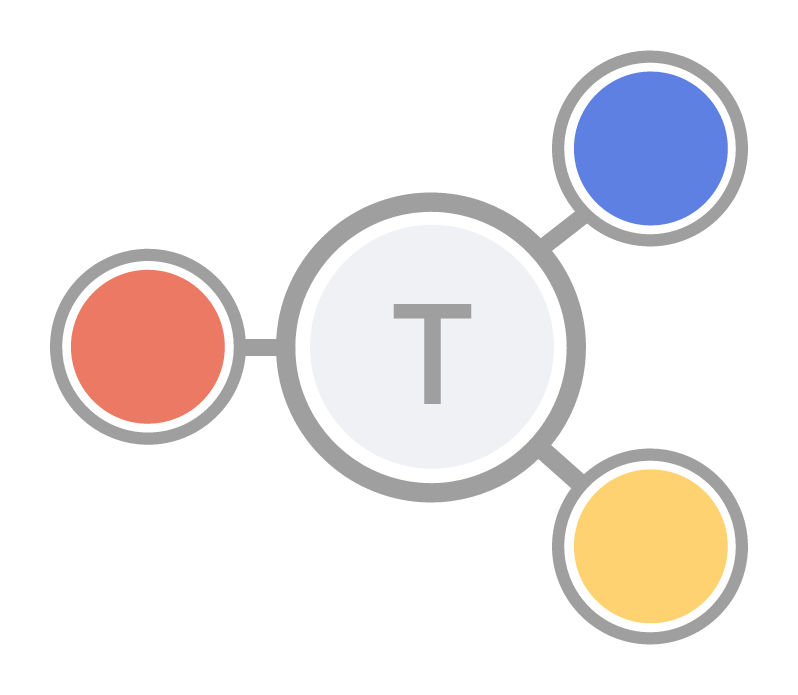

### The Hybrid Graph Datastore/Computational Engine ###

---

## Features

- Distributed, resilient, and fast static graph database.
- Support distributed computation.
- Online queries and traversal.
- Scalable to billions of nodes and edges.
- Easy setup for both cluster and single instance installations.
- User friendly and intuitive interface for graph analysis, fast algorithm processing and visualization.
 