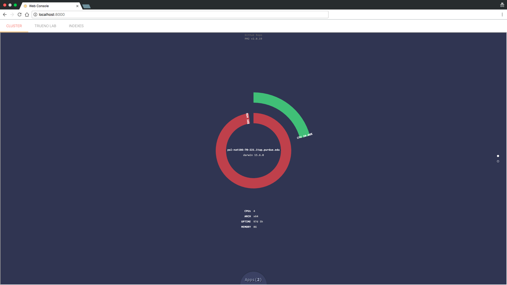

# Quick Start

---

You can get started with Trueno pretty easy and fast. You just need a few dependencies:

## Dependencies

* **Java 8** or later
* **Node.js 6** with **npm** or later
* **tar** and **unzip**

## Installing and running Trueno

The following [asciinema](https://asciinema.org/a/3wkksthmquso83awaeucg4v1b) is an interactive video of how to install and run Trueno.
 
**Note**: You can pause and copy text from the interactive video.

<script type="text/javascript" src="https://asciinema.org/a/3wkksthmquso83awaeucg4v1b.js" id="asciicast-3wkksthmquso83awaeucg4v1b" async></script>

Thats it! you should have Trueno up and running by now. Go to your **browser** to visit the web console at:

```
http://localhost:8000
```

You should see the following web page:



