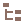

# Codebase Structure

---

## Structure

The following file tree describes how the project is structure. More details about tooling follows.

**trueno** 
&nbsp;&nbsp;&nbsp;&nbsp;**assets**: Project assets such as images and icons. 
&nbsp;&nbsp;&nbsp;&nbsp;**conf**: Trueno configuration files(sources, settings, hostnames and ports). 
&nbsp;&nbsp;&nbsp;&nbsp;**lib**: Where all logic resides(sources). 
&nbsp;&nbsp;&nbsp;&nbsp;**test**: Testing suite directory. 
&nbsp;&nbsp;&nbsp;&nbsp;**.gitignore**: Git ignore. 
&nbsp;&nbsp;&nbsp;&nbsp;**gulpfile.js**: Gulp configuration file. 
&nbsp;&nbsp;&nbsp;&nbsp;**LICENCE**: The project licence. 
&nbsp;&nbsp;&nbsp;&nbsp;**package.json**: The Node.js modules configuration file. 
&nbsp;&nbsp;&nbsp;&nbsp;**README.md**: The readme instruction file. 

## Codebase

The most important directories of the project are **conf** and **lib**.

**conf** 
&nbsp;&nbsp;&nbsp;&nbsp;**gremlin-server**: The Gremlin Server configuration and binaries for the Trueno backend. 
&nbsp;&nbsp;&nbsp;&nbsp;**pm2-gui-custom.ini**: The [PM2 GUI](https://github.com/Tjatse/pm2-gui) custom configuration. 
&nbsp;&nbsp;&nbsp;&nbsp;**pm2-gui-custom.ini**: The [PM2 GUI](https://github.com/Tjatse/pm2-gui) configuration. 
&nbsp;&nbsp;&nbsp;&nbsp;**trueno-component-sources.yaml**: The [components](../deployment-install/install.html#download-and-install-internal-components) sources(download links and info. 
&nbsp;&nbsp;&nbsp;&nbsp;**trueno-config.yaml**: Trueno configurations and **components settings overwrites**. 
&nbsp;&nbsp;&nbsp;&nbsp;**trueno-config.yaml**: Trueno configurations and **components settings overwrites**. 
&nbsp;&nbsp;&nbsp;&nbsp;**trueno-post-install.yaml**: Post component installation sources/commands. 

**lib** 
&nbsp;&nbsp;&nbsp;&nbsp;**balancer**: Websocket load balancer sources. 
&nbsp;&nbsp;&nbsp;&nbsp;**compute**: Graph compute layer sources. 
&nbsp;&nbsp;&nbsp;&nbsp;**console**: Trueno CLI console sources. 
&nbsp;&nbsp;&nbsp;&nbsp;**core**: Trueno core(central component sticking everything together) sources 
&nbsp;&nbsp;&nbsp;&nbsp;**search**: Indexing and search layer(elasticsearch) sources. 
&nbsp;&nbsp;&nbsp;&nbsp;**ui**: Web UI sources. 
&nbsp;&nbsp;&nbsp;&nbsp;**trueno-balancer.js**: The load balancer entry script.  
&nbsp;&nbsp;&nbsp;&nbsp;**trueno-console.js**: The console entry script.  
&nbsp;&nbsp;&nbsp;&nbsp;**trueno-post-start.js**: Trueno's post initialization entry script.  
&nbsp;&nbsp;&nbsp;&nbsp;**trueno-setup.js**: The setup entry script. 
&nbsp;&nbsp;&nbsp;&nbsp;**trueno-start.js**: Trueno engine-start entry script. 
&nbsp;&nbsp;&nbsp;&nbsp;**trueno-stop.js**: Trueno execution halt script. 
&nbsp;&nbsp;&nbsp;&nbsp;**trueno-tools.js**: Command line tools entry script. 
&nbsp;&nbsp;&nbsp;&nbsp;**trueno.js**: Trueno **main** execution script. 

Finally, the most complex and important structure to explain may be the **core** directory:

**core** 
&nbsp;&nbsp;&nbsp;&nbsp;**api**: The communication protocol library, all client calls are here. 
&nbsp;&nbsp;&nbsp;&nbsp;**binaries**: Components binary folder, generated after setup.  
&nbsp;&nbsp;&nbsp;&nbsp;**communication**: The WebSocket library for clients and internal communication. 
&nbsp;&nbsp;&nbsp;&nbsp;**data**: The default data directory. Generated at runtime if no data path is provided. 
&nbsp;&nbsp;&nbsp;&nbsp;**data_structures**: Shared datastructures, ex. Graph, Vertice, and Edge. 
&nbsp;&nbsp;&nbsp;&nbsp;**enum**: Trueno enumerators. 
&nbsp;&nbsp;&nbsp;&nbsp;**initialize**: The initialization library, the initial execution flow begins here. 
&nbsp;&nbsp;&nbsp;&nbsp;**logging**: The logging library. 
&nbsp;&nbsp;&nbsp;&nbsp;**status**: The metrics analyzer library. 

